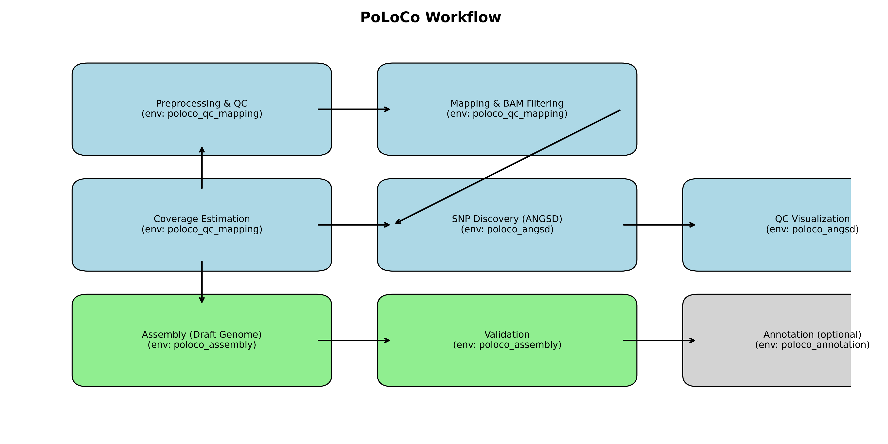

🧬 PoLoCo Workflow

Reproducible pipeline for pooled draft genome assembly and Pool-Seq SNP analysis of non-model invertebrates

📖 Overview

PoLoCo (Pooled Low-Coverage) is a reproducible, open-source workflow for:

Generating draft genomes from ethanol-preserved, pooled specimens.

Performing Pool-Seq read mapping and SNP discovery with ANGSD.

Running extensive QC at each stage for transparency and reproducibility.

Providing optional modules for genome assembly validation and annotation.

This workflow was developed for Entomobrya nivalis (Collembola) but is generalizable to other non-model invertebrates.
It accompanies the manuscript:

PoLoCo: A reproducible workflow for pooled draft genome assembly and population genomics of ethanol-preserved invertebrates
Mohammad Jamil Shuvo et al., [link pending journal publication].

⚙️ Installation
1. Clone this repository
git clone git@github.com:MohammadJamilShuvo/PoLoCo-workflow.git
cd PoLoCo-workflow

2. Install environments

We use modular conda environments to avoid dependency conflicts.

conda env create -f configs/envs_qc_mapping.yml
conda env create -f configs/envs_angsd.yml
conda env create -f configs/envs_assembly.yml
conda env create -f configs/envs_annotation.yml

Activate one before running each step:

conda activate poloco_qc_mapping   # for QC, mapping, coverage
conda activate poloco_angsd        # for SNP calling, QC visualization
conda activate poloco_assembly     # for assembly, validation
conda activate poloco_annotation   # for annotation

📂 Workflow Structure
Step	Script	Tools	Conda Env	Output
1. Preprocessing & QC	scripts/01_preprocessing_qc.sh	fastp, FastQC, MultiQC	poloco_qc_mapping	Trimmed reads, QC plots
2. Mapping & Filtering	scripts/02_mapping_dedup_filter.sh	BWA, samtools, Picard	poloco_qc_mapping	Filtered BAMs
3. Coverage Estimation	scripts/03_coverage_depth.sh	samtools	poloco_qc_mapping	Coverage per pool
4. SNP Discovery	scripts/04_angsd_snp_calling.sh	ANGSD	poloco_angsd	SAF, SFS, MAF, SNP stats
5. QC Visualization	scripts/05_qc_visualization.sh	Python QC scripts	poloco_angsd	Plots + master QC table
6. Assembly	scripts/06_assembly.sh	MEGAHIT, BUSCO	poloco_assembly	Draft genome assembly
7. Validation	scripts/07_validation.sh	QUAST, FastANI	poloco_assembly	Assembly validation
8. Annotation (optional)	scripts/08_annotation.sh	RepeatModeler, RepeatMasker, BRAKER2, eggNOG, InterProScan	poloco_annotation	Genome annotation

  

QC Python scripts are in qc_scripts/:

fastp_qc.py – preprocess QC

alignment_qc.py – mapping QC

angsd_sfs_maf_qc.py – allele frequency spectrum

angsd_summary_stats_qc.py – SNP summaries

final_qc_master.py – integrated QC table

🚀 Usage
Run the whole pipeline
sbatch scripts/run_poloco_pipeline.sh --step all

Run only one step (e.g. SNP discovery)
sbatch scripts/run_poloco_pipeline.sh --step 4

Run QC visualization after ANGSD
sbatch scripts/run_poloco_pipeline.sh --step 5

📊 Outputs

02_trimmed_reads/ – trimmed FASTQ files

03_alignments/ – raw BAMs

04_bam_filtered/ – filtered, deduplicated BAMs

05_coverage/ – coverage per pool

06_angsd/ – ANGSD outputs (SFS, MAF, SNP stats)

07_plots/ – QC plots + master QC table

08_assembly/ – draft genome assembly

09_validation/ – QUAST + FastANI results

10_annotation/ – RepeatMasker, BRAKER2, InterProScan, eggNOG results

🙌 Contributing

Contributions, issues, and pull requests are welcome!

📖 Citation

If you use this workflow in your research, please cite:

Mohammad Jamil Shuvo et al. (2025). PoLoCo: A reproducible workflow for pooled draft genome assembly and population genomics of ethanol-preserved invertebrates. [Journal link pending].

Also cite the original tools: fastp
, ANGSD
, MEGAHIT
, BUSCO
, BRAKER2
, etc.

📜 License

This project is licensed under the MIT License.
